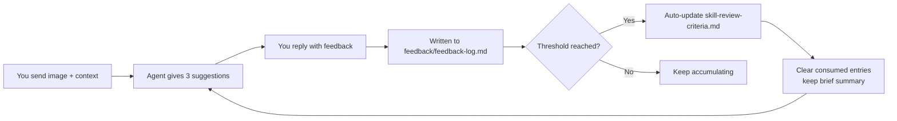

# AI Visual Improvement Assistant

**AI 视觉改稿建议助手**

[](https://github.com/HDC327/ai-visual-audit-skill/blob/master/LICENSE) [](https://www.npmjs.com/package/ai-visual-audit-skill) [](https://github.com/HDC327/ai-visual-audit-skill/blob/master) [](https://github.com/HDC327/ai-visual-audit-skill/blob/master) [](https://github.com/HDC327/ai-visual-audit-skill/blob/master) [](https://github.com/HDC327/ai-visual-audit-skill/blob/master)

> Send an image, get **where to look, why it matters, and what to change first** — no scores, no verdicts, just the 3 spots worth fixing.

[中文 README](https://github.com/HDC327/ai-visual-audit-skill/blob/master/README.md)

---

## What You'll Get

Send this campaign banner to an agent with the Skill installed:

```
[Double 11 App Hero Banner]
┌──────────────────────────────────────────────────────────────┐
│  ①Brand logo   ②Headline "Double 11 Sale"   ③Countdown      │
│                                                              │
│          [Hero visual: product image, ~60% of frame]         │
│                                                              │
│  ┌───────────────────────────────────────────────────────┐  │
│  │       Buy Now                 Final price ¥99         │  │
│  └───────────────────────────────────────────────────────┘  │
└──────────────────────────────────────────────────────────────┘
```

You get this immediately:

```
Overall suggestion: Small revisions suggested
Basis: Based on image inference only
My read of the image: Double 11 app hero banner — goal is final price visibility and click-through

Top 3 issues to look at first:
1. Location: Image 1, center, "Final price ¥99"
   Priority: Worth improving
   Issue: Price size vs. supporting text — not enough contrast for mobile small-screen scanning
   Why it matters: The hero's core job is making users want to tap the moment they see the price
   How to revise: Scale up ¥99 by 1.5–2×, add breathing room around it, reduce surrounding decoration

2. Location: Image 1, bottom center, "Buy Now" button
   Priority: Worth improving
   Issue: Button-to-background contrast is low; click intent is weak
   Why it matters: The CTA is the final action the hero needs users to take — it should carry the strongest visual weight
   How to revise: Raise button fill saturation, or add an outline + subtle shadow to separate it from the background

3. Location: Image 1, top right, countdown timer
   Priority: Fine as-is
   Issue: Digits are readable but stroke weight is thin
   How to revise: Increase digit weight for a stronger urgency signal

Quick-scan clear: Product image clarity, overall color atmosphere
One-line brief for the designer: Prioritize making "¥99" the visual anchor, then boost CTA contrast
Please confirm: I read "Final price ¥99 / Buy Now" — please confirm it's correct
Next (optional): Want a ready-to-paste revision prompt for issue 1?
```

<!-- 💡 Tip: replace this section with a real screenshot showing the nine-grid annotated review output.
     Example: 
     For a visual audit tool, this is the single most important image in the README. -->

---

## Why "Advice" and Not "Verdict"

| Verdict-style AI review | Advice-style review (this Skill) |
|---|---|
| "This image scores 72 — below threshold." | "Fix first: benefit copy is buried under decoration." |
| Feels like grading | Feels like practical editing guidance |
| User still doesn't know where to start | User checks the flagged areas first |
| AI may sound overly final | AI suggests; the human decides |

---

## Installation

This is a standard [Agent Skill](https://code.claude.com/docs/en/skills) (`SKILL.md` + `references/`) and works with Claude Code, Codex, Cursor, and other SKILL.md-compatible tools.

### Option 1: npm (recommended)

npm package: [ai-visual-audit-skill](https://www.npmjs.com/package/ai-visual-audit-skill)

```bash
# Personal install, available across all projects (~/.claude/skills)
npx ai-visual-audit-skill

# Project-only install (./.claude/skills, good for committing with a repo)
npx ai-visual-audit-skill --project

# Install for Codex (~/.codex/skills)
npx ai-visual-audit-skill --codex

# Install into any directory (e.g. Cursor or a custom agent)
npx ai-visual-audit-skill --dir ~/.cursor/skills
```

The installer copies `SKILL.md` and `references/` into an `ai-visual-audit/` folder under the target location. Re-running it overwrites the previous install; pass `--force` to skip the overwrite notice.

> If the agent doesn't pick up the skill right away, restart the session.

See all options with `npx ai-visual-audit-skill --help`

### Option 2: Manual install

```bash
git clone https://github.com/HDC327/ai-visual-audit-skill.git

# Personal (all projects)
cp -r ai-visual-audit-skill ~/.claude/skills/ai-visual-audit

# Or project-scoped (current repo only)
cp -r ai-visual-audit-skill .claude/skills/ai-visual-audit
```

Just make sure the target directory is named `ai-visual-audit` (matching the `name` in `SKILL.md`) and contains `SKILL.md` and `references/`.

> **Windows users**: prefer `npx ai-visual-audit-skill`; for manual copy, drag the folder in File Explorer, or run the `cp` commands above in Git Bash.

---

## Get Started in 30 Seconds

Send images and a few lightweight context notes to an agent with this Skill installed:

```
Help me improve this image.
Use case: Double 11 app hero banner.
Goal: emphasize final price and immediate purchase.
Extra requirements: keep the brand logo and "Buy Now" CTA.
Images: attached.
```

**Images alone work fine.** The agent won't stall waiting for context — it infers the likely use case from the image, gives the full review right away, and clearly marks the read as inferred, then adds one optional line inviting you to share the real use case for a sharper follow-up.

---

## Language Note

`SKILL.md` does not have to be written in English. This project uses a Chinese-first body so Chinese visual review workflows stay natural, while the frontmatter `name` remains hyphenated English and the `description` keeps both English and Chinese trigger phrases for better discovery across agents.

---

## Core Capabilities

- **Maximum 3 key issues** — forces prioritization; avoids overwhelming you with 15 things at once
- **Precise locations** — a consistent nine-grid vocabulary (top-left / center / bottom strip…) plus what's there, so you instantly know where to look
- **No blocking questions** — context helps, but if it's absent the agent infers and delivers a full review immediately, with a single optional follow-up at the end
- **Multi-image ready** — a one-line verdict per image first, then global priorities across images; for comparisons it tells you which one better serves your goal
- **Actionable revision advice** — each finding includes location, why it matters, and what to change; ask for a ready-to-paste revision prompt whenever you need one
- **Image quality check** — if an image is blurry or too small, the agent flags its confidence as limited upfront and suggests a clearer version
- **Key text read-back** — prices, dates, brand names are read back verbatim for your confirmation; the agent never pretends a detail is verified

---

## Self-Evolution: How Feedback Becomes Better Reviews

No forms to fill out. Just reply naturally:

```
You: "This one is wrong — the logo placement was a client requirement"
You: "You missed the disclaimer copy at the bottom"
You: "Don't score it, just give suggestions"
You: "This call was accurate"
```

The Skill silently classifies those replies as feedback signals, writes them to `references/feedback/feedback-log.md`, and automatically adjusts judgment rules once a threshold is reached:



Consumed feedback entries are cleared from the active log, with only a one-line summary kept in `references/feedback/change-log.md` — so logs don't grow without bound.

<!-- 💡 Tip: a before/after comparison showing output quality improving over several rounds of feedback
     would make this mechanism much more convincing than text alone. -->

---

## Fits / Doesn't Fit

**Fits**: marketing images, banners, posters, landing pages, product images, social covers, brand visuals, product launch materials, and AIGC material observations.

**Doesn't fit**: finance, medical, legal final review; automated content-safety blocking; any workflow requiring formal accountability or legal sign-off.

---

## File Structure

```
ai-visual-audit-skill/
├── SKILL.md                          # Skill entry: triggers, core rules, default output format
├── package.json                      # npm package config
├── bin/
│   └── cli.js                        # npx installer
├── README.md
├── README-en.md
└── references/
    ├── skill-review-flow.md          # Execution protocol and output format
    ├── skill-review-criteria.md      # Material types, dimensions, risk levels (always loaded)
    ├── skill-review-redlines.md      # Compliance and copyright redlines (loaded only when suspected)
    ├── skill-review-optimizer.md     # Feedback classification and self-evolution rules
    ├── feedback/
    │   ├── feedback-log.md           # Unconsumed feedback signals
    │   └── change-log.md             # Brief summaries of consumed feedback
    ├── content-quality-standards/    # Quality criteria by material type
    ├── content-safety-standards/     # Content safety judgment standards
    └── visual-design-audit-dimensions/ # Visual design audit dimension details
```

---

## How to Adapt to Your Business

The real domain knowledge lives in `references/skill-review-criteria.md`. You can replace material types, placement scenarios, campaign nodes, and risk boundaries there — while keeping the output pattern: at most 3 key issues, each with location + why it matters + how to revise.

---

## Known Limitations

- **Image-only input is not a full judgment**: the agent infers likely use and reviews right away (then invites you to add context), but cannot verify the real brief, pricing, copy, campaign rules, or brand standards.
- **Creative judgment is weaker**: the agent usually cannot access recent comparable assets, so similarity/cliché judgments are low-to-medium confidence.
- **Text and prices need human verification**: the agent reads small copy, dates, and prices back to you for confirmation, since image models can misread them.

---

## License

MIT © 2026 HDC327
