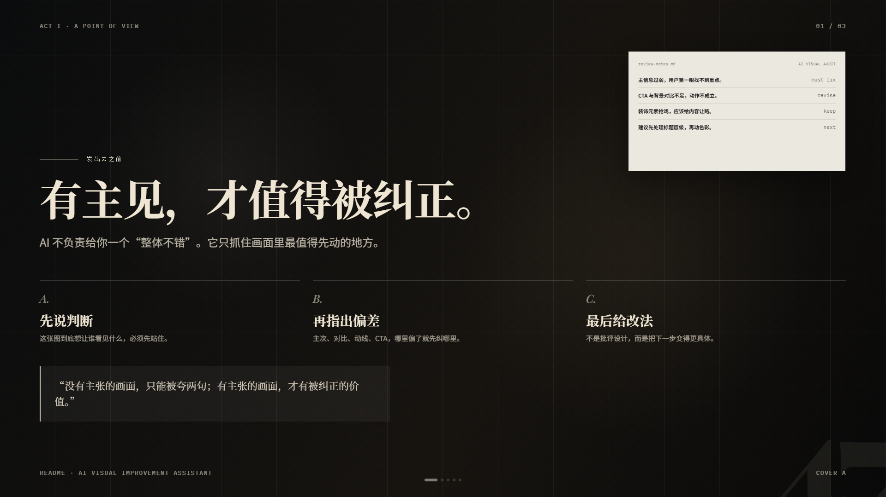
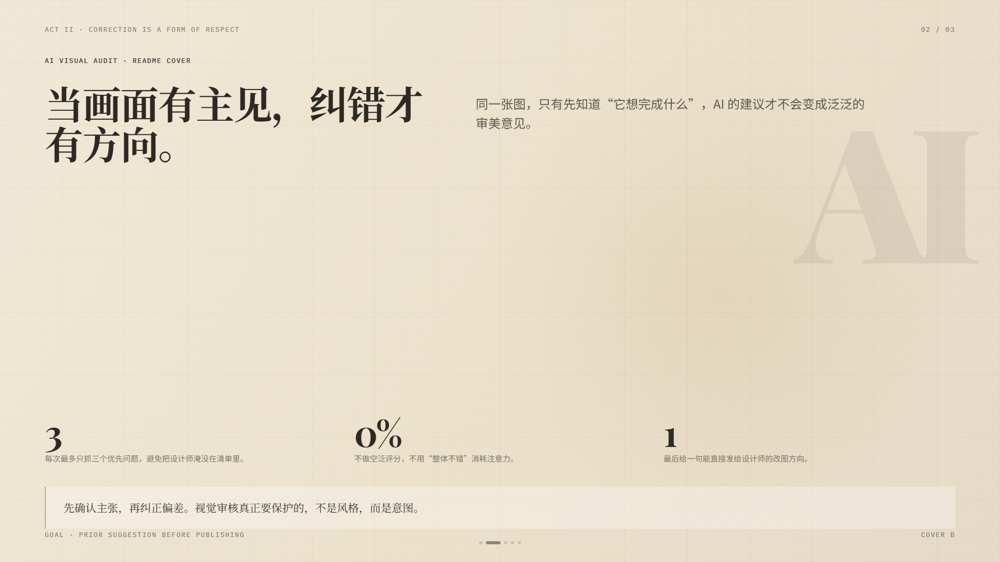
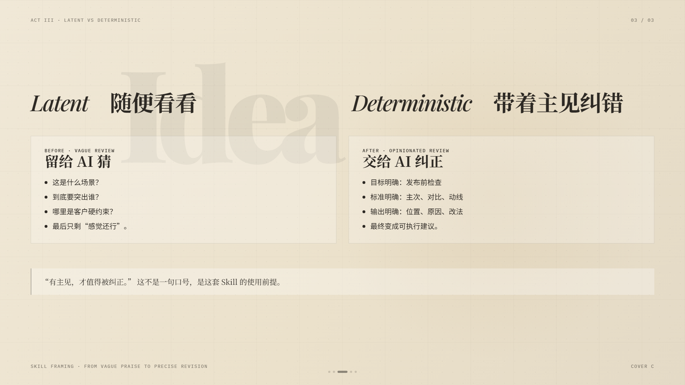

# 图发出去之前，让 AI 帮你挑一遍毛病

**AI Visual Improvement Assistant**

[](https://github.com/HDC327/ai-visual-audit-skill/blob/master/LICENSE) [](https://www.npmjs.com/package/ai-visual-audit-skill) [](https://github.com/HDC327/ai-visual-audit-skill/blob/master) [](https://github.com/HDC327/ai-visual-audit-skill/blob/master) [](https://github.com/HDC327/ai-visual-audit-skill/blob/master) [](https://github.com/HDC327/ai-visual-audit-skill/blob/master)

把图发给它，它告诉你：**先改哪里、为什么、怎么改**。  
不打分，不下结论，不说"整体不错"——直接给你 3 个值得先动的地方。

[English README](https://github.com/HDC327/ai-visual-audit-skill/blob/master/README-en.md)



---

## 用起来是这个感觉

你把大促 Banner 发给装了这个 Skill 的 AI，随口说一句：

```
帮我看看这张图
[附上图片]
```

它直接开始看：

```
整体建议：建议小改
图片类型：海报
判断依据：仅基于画面推测
我先按画面理解：大促 App 首焦 Banner，目标是让人看见价格就想点

先看这 3 个地方：

1. 正中，「到手价 ¥99」· 必须先改
   问题：价格字号和旁边文字差距太小，手机小屏第一眼找不到重点
   为什么：关键文字可读性是海报最基本的功能，这条失效其他都白搭
   怎么改：「¥99」放大 1.5 倍，四周多留白，减少旁边装饰的干扰

2. 底部通栏，「立即抢购」按钮 · 建议优化
   问题：按钮颜色和背景太接近，扫一眼根本看不出来这是个可以点的按钮
   为什么：CTA 是整张图最后要用户完成的动作，视觉权重必须最强
   怎么改：加深按钮填充色，或加白色描边让它从背景跳出来

3. 右上，倒计时 · 可以先放
   数字如果再粗一点，紧迫感会更强

给设计师的一句话：优先强化「¥99」视觉权重，再提升 CTA 按钮对比度
确认一下：我看到的是「到手价 ¥99 / 立即抢购」，这个对吗？
下一步（可选）：要我帮第 1 处写一段可以直接发给设计师的改图说明吗？
如果有哪里判断不准，直接告诉我，我会记下来把之后的判断调得更准。
```

你把背景说得越清楚，建议就越准——但什么都不说只发图片，它也能看。

## 它用什么标准看图



不管什么图，有一条底层逻辑穿透所有判断：

> **每个视觉元素，要么在引导注意力，要么在给引导注意力的东西让路。没有中间地带。**

基于这条，它首先判断你发的图是什么类型，然后用不同的标准来看：

**如果是有文字的海报**（大促图、品牌海报、社交封面……）

最不能逾越的是这四条：构图是否主次分明、关键文字能否被 3 秒看清、明暗对比是否区分了层级、视觉动线是否能从主信息走到 CTA。**这四条任何一条出问题，直接列为"必须先改"，不会被其他问题压下去。**

纵深感和风格统一是加分项——有则提质，没有不扣分。

**如果是没有文字的素材**（背景图、装饰元素、产品图、素材包……）

最高标准只有一个词：**易用性**。背景要让位给叠加的内容，装饰不能比主角更显眼，产品图一眼就知道主体是什么。没有让位意识的素材，不管单独看多好看，都是不合格的素材。

---

## 安装

本 Skill 支持 Claude Code、Codex、Cursor 等工具，是标准的 [Agent Skill](https://code.claude.com/docs/en/skills) 格式（`SKILL.md` + `references/`）。

### 方式一：npm（推荐）

```bash
# 安装到当前用户，所有项目都能用（~/.claude/skills）
npx ai-visual-audit-skill

# 只装在当前项目里（适合随仓库一起提交）
npx ai-visual-audit-skill --project

# 安装到 Codex
npx ai-visual-audit-skill --codex

# 安装到任意目录（Cursor、自定义 Agent 等）
npx ai-visual-audit-skill --dir ~/.cursor/skills
```

装完之后在 AI 里重启一次会话就好。重复执行会直接覆盖更新；`--force` 跳过覆盖提示。

> Windows 用户建议用 npx 安装，或在 Git Bash 里跑手动安装命令。

### 方式二：手动安装

```bash
git clone https://github.com/HDC327/ai-visual-audit-skill.git
cp -r ai-visual-audit-skill ~/.claude/skills/ai-visual-audit    # 个人级
# 或
cp -r ai-visual-audit-skill .claude/skills/ai-visual-audit      # 项目级
```

---

## 不同情况怎么用

**只发图片，什么都不说**

它会先问你一句再开始审核：

> "这张图主要用在哪里？大促 Banner、小红书封面、品牌海报……说个大方向就行。"

这一问是为了让判断标准更准——你回答之后，它才会给出完整建议。如果你不想回答，随便说个"随便看看"或者直接催它，它也会按画面推测继续。

**有具体场景，多说一点**（一句话就够）

```
[附上图片]
618 活动落地页顶图，要突出「立减 200」，按钮要能点，logo 必须留
```

**两张方案，不知道选哪张**

```
[附上图 A、图 B]
这两张用来发小红书，哪张留住人的效果更好？
```

**改完了想再过一遍**

```
[改过的图]
第 1 处改了，你再帮我看看
```

**发了素材不是海报**

直接发就行——它会自己判断这是背景图还是装饰元素还是产品图，然后切换到对应的审核标准（易用性优先，而不是信息层级优先）。

---

## 用几次之后，它会越来越准



你不需要填表打分。就算随口说一句，它都会记下来：

- **「这条不对，那个位置是客户要求必须放的」** → 记住，之后不会再挑这类问题
- **「你漏看了底部的免责小字」** → 记住，下次更仔细看那个区域
- **「这条说到点了」** → 记住，知道这类判断是对的

积累够了，它会自动把判断规则调一遍，让之后的建议更贴你们的实际情况。

**积累了什么，你随时可以看。** 安装目录下的 `references/rules-summary.md` 里，用人话记录了哪些问题已经确认可以忽略、哪些地方需要重点关注、你更喜欢哪种输出格式。这个文件你也可以直接手动编辑——写上去的内容，下次审核时 AI 会直接读取生效。

---

## 什么情况下最好用

- 大促 Banner、海报、落地页顶图
- 商品主图、小红书封面、品牌宣传图
- 背景图、装饰素材、AIGC 生成素材发布前检查
- 有图但没有设计师帮你把关

简单说：**图做完了，想过一遍，不知道先改哪里**——都可以用。

---

## 它做不到的事

- **价格、日期、活动规则要你自己最后确认**——AI 偶尔会看错小字，涉及这些它会把读到的内容说出来请你核对，但你才是最终那一关
- **金融、医疗、法律类图片的合规审核**——这是法律问题，不是视觉问题，管不了
- **判断"和之前的图是不是雷同"**——它没有你们历史素材库，这条建议只能是参考

---

## 想按自己业务定制

核心的判断规则在 `references/skill-review-criteria.md` 里，你可以直接替换物料类型、投放场景、风险边界——保留「最多 3 个重点问题 + 位置 + 为什么 + 怎么改」这套输出方式不变。

也可以直接编辑 `references/rules-summary.md`，把你们团队确认的规则手动写进去，AI 下次会话就会直接生效。

---

## License

MIT © 2026 HDC327
