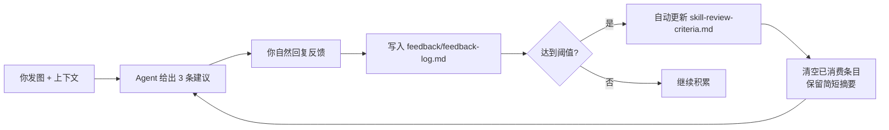

# AI 视觉改稿建议助手

**AI Visual Improvement Assistant**

[](https://github.com/HDC327/ai-visual-audit-skill/blob/master/LICENSE) [](https://www.npmjs.com/package/ai-visual-audit-skill) [](https://github.com/HDC327/ai-visual-audit-skill/blob/master) [](https://github.com/HDC327/ai-visual-audit-skill/blob/master) [](https://github.com/HDC327/ai-visual-audit-skill/blob/master) [](https://github.com/HDC327/ai-visual-audit-skill/blob/master)

> 把图片发给 AI，马上知道**先改哪里、为什么、怎么改**——不打分、不裁判，只帮你找最值得先动的 3 个地方。

[English README](https://github.com/HDC327/ai-visual-audit-skill/blob/master/README-en.md)

---

## 你会得到什么

把这张大促 Banner 发给安装了本 Skill 的 Agent：

```
[大促 App 首焦 Banner]
┌─────────────────────────────────────────────────────────────┐
│  ①品牌logo   ②主标题 "双11 狂欢价"   ③倒计时 00:12:33      │
│                                                             │
│         [主视觉：商品图，占据画面 60%]                         │
│                                                             │
│  ┌──────────────────────────────────────────────────────┐  │
│  │     立即抢购          到手价 ¥99                      │  │
│  └──────────────────────────────────────────────────────┘  │
└─────────────────────────────────────────────────────────────┘
```

你会立刻得到：

```
整体建议：建议小改
判断依据：仅基于画面推测
我先按画面理解：大促 App 首焦 Banner，目标是突出到手价和点击转化

我最建议你先看这 3 处：
1. 位置：正中，「到手价 ¥99」
   优先级：建议优化
   问题：价格字号与副文案差距不足，移动端小屏第一眼抓不到价格
   为什么：首焦的核心任务是让用户一眼看见价格就想点
   怎么改：「¥99」放大 1.5–2 倍，周围留白，减少装饰层干扰

2. 位置：正下，「立即抢购」按钮
   优先级：建议优化
   问题：按钮与背景色对比度偏低，点击意愿弱
   为什么：CTA 是首焦最终要用户完成的动作，视觉权重要最强
   怎么改：提升按钮填充色饱和度，或加描边+阴影与背景区分

3. 位置：右上，倒计时
   优先级：可略过
   问题：时间数字可辨识，但字重偏细
   怎么改：数字字重加粗，增强紧迫感

可以快速略过：主体商品清晰度、整体氛围色调
给设计师的一句话：建议优先强化价格「¥99」视觉权重，再提升 CTA 按钮对比度
需要你再确认：我读到的是「到手价 ¥99 / 立即抢购」，请确认是否正确
下一步（可选）：要我针对第 1 处生成一段可直接粘贴的改图 prompt 吗？
```

<!-- 💡 建议：在这里替换成你的真实截图，展示带九宫格标注的审核建议界面
     示例：
     这对于一个"视觉审核"工具来说是最重要的一张图 -->

---

## 为什么是「建议」而不是「裁判」

| 裁判式 AI 审核 | 建议式（本 Skill） |
|---|---|
| 「这张图 72 分，不合格。」 | 「建议先改：利益点被装饰压住。」 |
| 像在给作品判分 | 像在帮你找优先修改点 |
| 读完仍不知道先改哪里 | 直接看被指出的位置 |
| AI 容易显得过度武断 | AI 只提建议，最终决定由人做 |

---

## 安装

本 Skill 是一个标准的 [Agent Skill](https://code.claude.com/docs/en/skills)（`SKILL.md` + `references/`），支持 Claude Code、Codex、Cursor 等工具。

### 方式一：npm（推荐）

npm 包页：[ai-visual-audit-skill](https://www.npmjs.com/package/ai-visual-audit-skill)

```bash
# 安装到当前用户，对所有项目生效（~/.claude/skills）
npx ai-visual-audit-skill

# 只安装到当前项目（./.claude/skills，适合随仓库提交）
npx ai-visual-audit-skill --project

# 安装到 Codex（~/.codex/skills）
npx ai-visual-audit-skill --codex

# 安装到任意目录（如 Cursor、自定义 Agent）
npx ai-visual-audit-skill --dir ~/.cursor/skills
```

安装器会把 `SKILL.md` 和 `references/` 复制到目标位置下的 `ai-visual-audit/` 目录。重复执行可直接覆盖更新；`--force` 可跳过覆盖提示。

> 安装后如果 Agent 没有立刻识别到，重启一次会话即可。

查看全部参数：`npx ai-visual-audit-skill --help`

### 方式二：手动安装

```bash
git clone https://github.com/HDC327/ai-visual-audit-skill.git

# 个人级（所有项目可用）
cp -r ai-visual-audit-skill ~/.claude/skills/ai-visual-audit

# 或项目级（仅当前仓库）
cp -r ai-visual-audit-skill .claude/skills/ai-visual-audit
```

只需保证目标目录名为 `ai-visual-audit`（与 `SKILL.md` 中的 `name` 一致），且包含 `SKILL.md` 和 `references/`。

> **Windows 用户**：建议优先用 `npx ai-visual-audit-skill`；若手动复制，可用资源管理器拖拽文件夹，或在 Git Bash 中执行上述 `cp` 命令。

---

## 30 秒上手

把图片和几条最简单的上下文发给已安装本 Skill 的 AI Agent：

```
请帮我看这张图哪里需要优化。
用途：双11 App 首焦 Banner
目标：突出到手价和立即购买
补充要求：必须保留品牌 logo 和「立即抢购」
图片：见附件。
```

**只给图片也完全可以**。Agent 不会卡住等你回答——它会先根据画面反推可能用途，直接给出完整建议，并在结尾用一句话邀请你补充真实用途，方便下一轮给更准的建议。

---

## 语言说明

`SKILL.md` 不必须使用英文。这个项目的正文是中文执行手册，方便中文业务和视觉审核场景直接使用；frontmatter 里的 `name` 保持英文短横线格式，`description` 保留中英触发关键词，是为了让不同 Agent 更容易识别什么时候该启用这个 Skill。

---

## 核心能力

- **最多 3 个重点问题**：强制做优先级排序，避免一口气列出十几条让人无从下手
- **位置说得准**：统一用九宫格方位（左上 / 正中 / 底部通栏…）+ 那里是什么，一眼定位
- **不卡追问**：上下文能给就给，不给时 Agent 直接按画面推测给建议，只在结尾加一句可选追问
- **多图也能用**：多张图时先给每张一句话结论，再给跨图的全局重点；要对比时直接告诉你哪张更能达成目标
- **可直接改稿**：每条建议都包含位置、为什么重要、怎么改；还可让 Agent 生成可直接粘贴的改图 prompt
- **图片质量自检**：图片偏小或模糊时主动告知置信度受限，建议传更清晰的版本
- **关键文字复读**：价格、日期、品牌名等读取后原文念出来请你确认，而不是假装已经核对

---

## 自进化：反馈如何变成更准的建议

用户不需要填写专业表格，自然说就行：

```
你：「这条不对，logo 是客户要求必须放这里的」
你：「你漏看了底部的免责小字」
你：「不要给分，只要建议就好」
你：「这条判断准确」
```

Skill 会把这些回复静默整理为优化信号，写入本地 `references/feedback/feedback-log.md`，并在信号积累到阈值后自动调整判断规则：



已消费的反馈会从日志中清空，只在 `references/feedback/change-log.md` 保留一行摘要，避免日志无限增长。

<!-- 💡 建议：在这里加一张自进化流程的配图或 before/after 对比截图
     展示"反馈前"和"反馈后"输出质量的变化，会让这个机制更有说服力 -->

---

## 适合 / 不适合

**适合**：营销图、海报、Banner、落地页、商品主图、小红书封面、品牌图、新品发布图、AIGC 素材观察。

**不适合**：金融 / 医疗 / 法律等强合规终审、内容安全自动封禁、需要法律责任链路的自动裁决。

---

## 文件结构

```
ai-visual-audit-skill/
├── SKILL.md                          # Skill 入口：触发条件、核心规则、默认输出格式
├── package.json                      # npm 安装包配置
├── bin/
│   └── cli.js                        # npx 安装器
├── README.md
├── README-en.md
└── references/
    ├── skill-review-flow.md          # 执行协议与输出格式
    ├── skill-review-criteria.md      # 物料类型、审核维度、风险等级（始终读取）
    ├── skill-review-redlines.md      # 合规与版权红线（仅在疑似风险时读取）
    ├── skill-review-optimizer.md     # 反馈分类与自进化规则
    ├── feedback/
    │   ├── feedback-log.md           # 待消费的反馈信号
    │   └── change-log.md             # 已消费反馈的简短摘要
    ├── content-quality-standards/    # 各物料类型的质量细则
    ├── content-safety-standards/     # 内容安全判断标准
    └── visual-design-audit-dimensions/ # 视觉设计审核维度详解
```

---

## 如何迁移到你的业务

真正的领域知识在 `references/skill-review-criteria.md`。你可以替换其中的物料类型、投放场景、节点和风险边界；保留「最多 3 个重点问题」「位置 + 为什么 + 怎么改」这套输出方式不变。

---

## 已知局限

- **只给图片时不是完整判断**：Agent 会直接按画面推测用途给建议（并在结尾邀请你补充），但无法确认真实 brief、价格、文案、活动规则和品牌规范。
- **创意维度最弱**：Agent 通常不能访问近期同类历史物料，因此「是否雷同」只能作为低到中置信参考。
- **文字与价格必须人工复核**：图像模型可能看错小字、价格、日期，涉及事实准确性的判断需要人确认。

---

## License

MIT © 2026 HDC327
